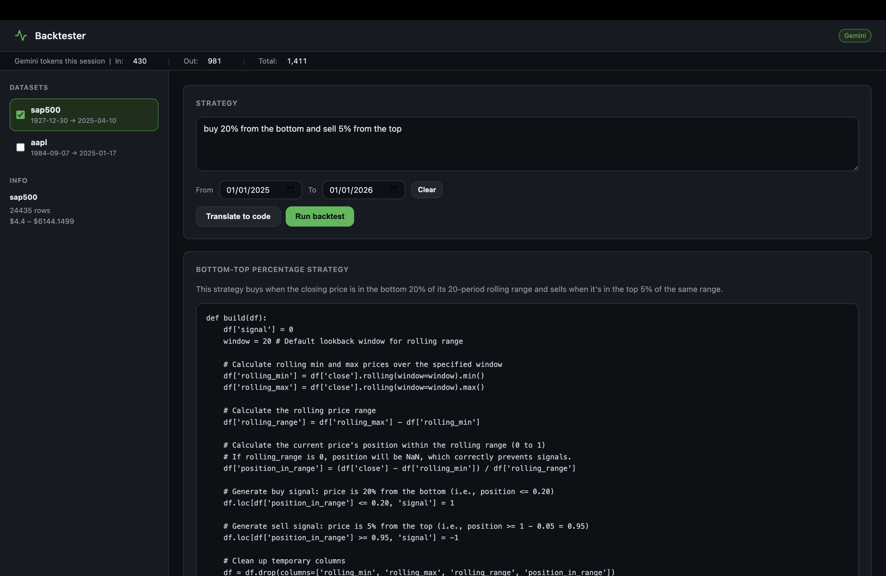
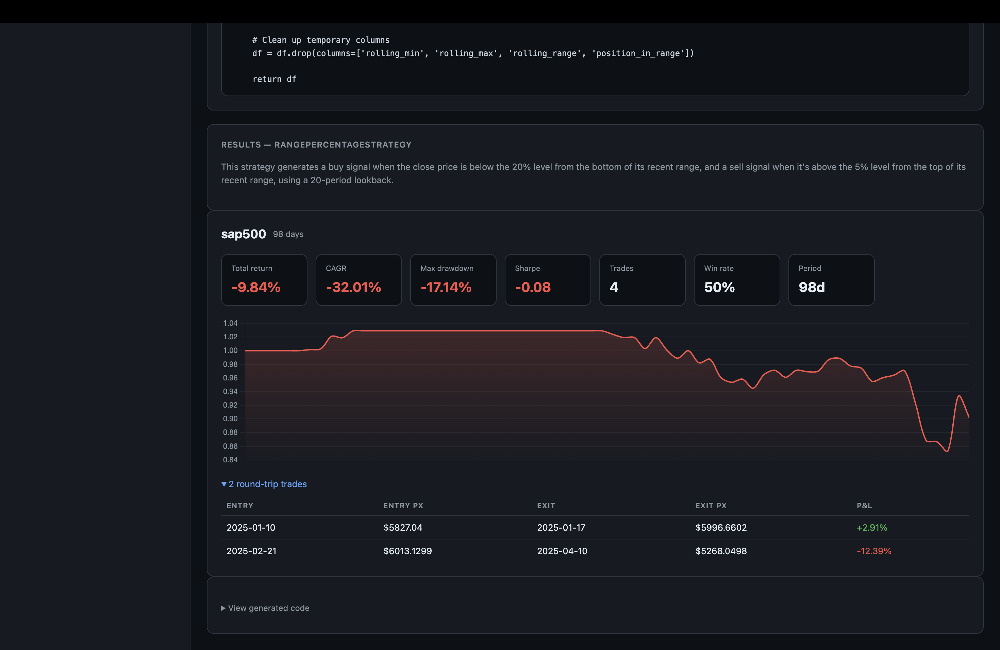

# Backtester

A lightweight web app that lets you describe a trading strategy in plain English, have Gemini write the code, and immediately backtest it against your own CSV price data.




## Features

- **Natural-language strategies** — describe what you want (e.g. *"buy when the 10-day MA crosses above the 50-day MA"*) and Gemini 2.5 Flash generates the Python logic
- **Instant backtesting** — runs against any CSV datasets you drop in the `data/` folder
- **Date subsetting** — restrict the backtest to any date range without modifying your data
- **Metrics** — total return, CAGR, max drawdown, Sharpe ratio, win rate, and a full trade log
- **Equity curve chart** — per-symbol Chart.js visualisation
- **Token tally** — live in/out/total Gemini token counter for the session

## Setup

**1. Clone and install dependencies**

```bash
pip install -r requirements.txt
```

**2. Add your Gemini API key**

Create a `.env` file in the project root (already gitignored):

```
GEMINI_KEY = "your-key-here"
```

Get a key at [aistudio.google.com](https://aistudio.google.com). Billing must be enabled — the free tier quota is very limited.

**3. Add price data**

Drop one or more CSV files into the `data/` folder. Each file must have at least two columns:

| Column | Notes |
|--------|-------|
| `Date` | Any format parseable by pandas (e.g. `2020-01-15`) |
| `Close` | Adjusted closing price |

The filename (without `.csv`) becomes the dataset name shown in the UI. Two example files are included: `aapl.csv` (Apple) and `sap500.csv` (S&P 500).

**4. Run**

```bash
python main.py
```

Then open [http://localhost:8000](http://localhost:8000).

## Usage

1. **Select datasets** in the left sidebar (one or more)
2. Optionally set a **From / To date range** to restrict the backtest window
3. **Describe your strategy** in the text box — be as specific or vague as you like
4. Click **Translate to code** to preview what Gemini generates, or go straight to **Run backtest**
5. Results appear with metrics, an equity curve, and a collapsible trade log

### Example prompts

```
Buy when the 20-day MA crosses above the 50-day MA, sell when it crosses back below
```
```
Buy when price is 15% above the 90-day low, exit after a 10% trailing drawdown or 60 days
```
```
Buy on new 52-week highs, sell if price falls 8% below the breakout level
```

## Configuration

| Environment variable | Default | Description |
|----------------------|---------|-------------|
| `GEMINI_KEY` | — | Google AI API key (required) |
| `GEMINI_MODEL` | `gemini-2.5-flash` | Any model from `client.models.list()` |

## CSV format

```
Date,Open,High,Low,Close,Volume
2020-01-02,296.24,300.60,293.98,300.35,33870100
2020-01-03,297.15,300.58,296.50,297.43,36580700
...
```

Only `Date` and `Close` are required — all other columns are ignored.

## How it works

1. Your description is sent to Gemini with a system prompt that constrains it to produce a `build(df)` function operating on a pandas DataFrame
2. The returned JSON (`name`, `explanation`, `code`) is parsed and the code is executed in a sandboxed `exec` environment with only `pd` and safe builtins available
3. The resulting signal column (`1` = buy, `-1` = sell, `0` = hold) drives a simple cash/shares simulator
4. Metrics and the equity curve are returned to the UI

## Project structure

```
backtester/
├── data/               # Drop CSV files here
├── main.py             # Server, strategy engine, and UI (single file)
├── requirements.txt
└── .env                # Your API keys (gitignored)
```
